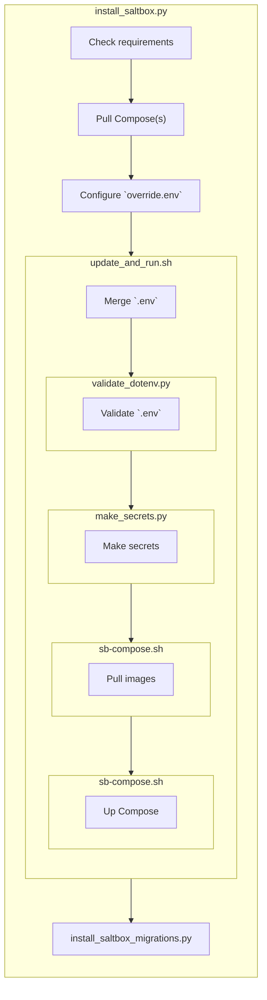

# Salt.Box Compose

> **NOTE:** Commands in examples suppose shell of non-root user and `docker` command requires root privileges
to operate. When working by root or `docker` needs no root privileges, `sudo` should be avoided.

> **ATTENTION!** Adding non-root user to `docker` group has some security risks because of ability to run privileged
commands through Docker Engine. Decide to set up Docker in [rootless
mode](https://docs.docker.com/engine/security/rootless/).


## About Salt.Box

Salt.Box is a configuration management system wich extends
[SaltStack](https://saltproject.io/) with web UI.

Look for user documentation on [saltbox.pro](https://saltbox.pro).


## Requirements

- Docker Engine >= 25.0 _(due to healthcheck feature)_
- Docker Compose >= 2.20.2
- Python >= 3.7.3 _(for helper scripts)_

There are recommended host settings:

```bash
sudo sh -c "echo 'vm.overcommit_memory=1' > /etc/sysctl.d/saltbox.conf"
sudo sysctl -p /etc/sysctl.d/saltbox.conf
```

`vm.overcommit_memory=1` is a Redis requirement.


## Helper scripts

Useful scripts are collected in [`./bin/`](./bin/) directory. They supposed to
be ran from the root of repo by relative path like `./bin/sb-compose.sh`.

- `get_ca.sh` — obtain `ca.crt` local authority certificate file (and
  optionally inject it into Firefox).
- `git_pull_dev_repos.py` — only for developers — update sources Git repositories.
- `install_saltbox.sh` — donwload Salt.Box Compose, configure and run.
- `install_saltbox_migrations.sh` — donwload Salt.Box Migrations Compose,
  configure and run.
- `make_secrets.py` — create required by system passwords.
- `sb-compose.sh` — thin wrapper over the `docker compose` command is the preferred way to
manipulate a running instance.
- `sb-exec.sh` — shortcuts for some common commands.
- `sb-images-export.sh` — dump current images to disk e.g. to use on an offline host.
- `sb-images-import.sh` — load dumped with `./bin/sb-images-export.sh` images.
- `update_and_run.sh` — the main startup script.
- `validate_dotenv.py` — check major issues in `.env` file.

Helper scripts supposed to be executable. Some systems may drop executable
flag due to security reasons. On troubles to start try to re-add the flag:

```bash
chmod a+x ./bin/*
```


## Quick start with `install_saltbox.py`

Obtain the [install_saltbox.py](./bin/install_saltbox.py) script and run in a
directory where you prefer to have Salt.Box Compose related stuff.

See `install_saltbox.py --help` for options.

When the `install_saltbox.py` will finish downloading and configuring, the
startup script `update_and_run.sh` will be executed.

Simlified script calls hierarhy:



## The startup script `update_and_run.sh`

Easy way to startup the system is to execute:

```bash
sudo ./bin/update_and_run.sh
```

The script:
- Merges `base.env` and `override.env` (if exists) into `.env` config.
- Makes secrets with `./bin/make_secrets.py`.
- Updates images.
- Prints default administrator credentials.
- Runs the Salt.Box instance with `./bin/sb-compose.sh`.

Use `override.env` to redefine `base.env` default values.

Use `-h` or `--help` flag to look script options.

To make the UI available on hostname or address other than `localhost` override
variables those defaults points to `localhost`.

> **ATTENTION!** Check there are no warnings on not setted variables to avoid
confusing errors.


## HTTPS

System requires HTTP connections to be SSL terminated. System creates a private
CA and a certificate for the web server on first run.

The authority certificate can be obtained with the command:

```bash
# System must be running
sudo ./bin/get_ca.sh
```

It will be saved to `ca.crt` file in the current directory and may be installed
then into a web browser to trust the web UI site.

Generated certificate is bind to `localhost` and `saltbox.local` DNS names by
default. To change it override `WEB_SERVER_SSL_ALT_NAMES_DNS` variable and/or
`WEB_SERVER_SSL_ALT_NAMES_IP` to access the system by IP address rather than a
DNS name. Both variables may be in form of comma separate list. DNS names may
be [RFC compliant
wildcards](https://www.rfc-editor.org/rfc/rfc6125#section-7.2)
(`*.saltbox.local`, but not `*saltbox.local`). Wildcards for IP addresses are
not supported.

**Restart** the system to apply changes and recreate the certificate.

Out-of-the-box certificate can be also replaced with a relative one:

```bash
# System have to had been started at least once
sudo ./bin/sb-compose.sh cp CUSTOM_CERT proxy:/etc/nginx/ssl/proxy.crt
sudo ./bin/sb-compose.sh cp CUSTOM_CERT_KEY proxy:/etc/nginx/ssl/proxy.key
```

> **ATTENTION!** Changing `WEB_SERVER_SSL_ALT_NAMES_*` variables will lead to
overwriting the custom certificate with new generated one.


## Working behind a reverse proxy

First, be sure to set `WEB_SERVER_OUTER_SOCKET` to match `server_name` and port
of the reverse proxy.

Nginx may be installed on the same host with Salt.Box, or on another one. In
the last case be sure the Salt.Box is available for the Nginx host e.g. with
command:

```bash
curl http://<SALTBOX_HOST>:<SALTBOX_WEB_SERVER_PORT>/auth/keycloak/realms/salt.box/.well-known/openid-configuration
```

It should return long JSON response.

An example Nginx config following. Remember to edit `< ... >` placeholders and
check config with `sudo nginx -t`.

```nginx
server {
  server_name <NAME>;
  client_max_body_size 256m;

  access_log /var/log/nginx/saltbox_access.log;
  error_log /var/log/nginx/saltbox_error.log;

  location / {
    add_header X-Frame-Options 'SAMEORIGIN';
    proxy_set_header Host $host;
    proxy_set_header X-Real-IP $remote_addr;
    proxy_set_header X-Forwarded-For $proxy_add_x_forwarded_for;
    proxy_set_header X-Forwarded-Proto $scheme;
    proxy_set_header X-Forwarded-Host $host;
    proxy_set_header Upgrade $http_upgrade;
    proxy_set_header Connection ‘upgrade’;

    proxy_pass https://<SALTBOX_HOST>:<SALTBOX_WEB_SERVER_PORT>;
  }

  listen 443 ssl http2;
  ssl_certificate <PATH_TO_CERT>;
  ssl_certificate_key <PATH_TO_CERT_KEY>;
  < OTHER SSL SETTTINGS DEPENDS ON CERT>
}

server {
  server_name <NAME>;
  listen 80;
  return 301 https://$host$request_uri;
}
```

> **NOTE:** Remember to set `WEB_SERVER_SSL_ALT_NAMES_*` variables in compliance
with `proxy_pass` URL.

## Autotests

To run test suites enable `compose-autotests.yaml` in the local`.env` file.
Then execute:

```bash
sudo ./bin/sb-compose.sh up autotests
```

Autotests depends on direct access to Keycloak API, so existing realm should be
recreated. As alternative the "Direct access grants" checkbox may be checked at
Keycloak client settings.

To prevent pulling a new image:

```bash
sudo ./bin/sb-compose up autotests --pull=never
```

## Dev mode

### Synopsis

Dev mode allows to build images instead of pulling pre-built and adds some
useful overrides.

Look at "Dev options" section of your [`base.env`](base.env) file copy.
To enable dev options uncomment required `COMPOSE_FILE=` lines. Than run
compose as usual.

Use `--watch` flag or toggle watch with `w` in attached mode to rebuld
dev-services on changes.

> **ATTENTION!** Do not use development mode on production environments cause it
may change the data.

### Build images in dev mode

To build clean images use command with enabled `COMPOSE_FILE` overrides:

```bash
sudo ./bin/sb-compose.sh build --no-cache
```

`--no-cache` guarantees build with latest dependencies.

### Connect to redis-salt Redis instance

Dev mode allows to connect to the Redis instance by URL
`rediss://localhost:6379` (SIC!). Since TLS is enabled client may skip
a certificate validation (option like `--insecure`) or use a CA certificate.
The last may be obtained with command:

```bash
# System must be running
sudo ./bin/get_ca.sh
```

### Dev minions

Dev mode provides amount of impersistent minions in replica mode. Look for
options in the [`base.env`](./base.env) file.

Dev minions does not keep their keys between restarts so keys will be dropped
on the master. Some operations may lead to lost minions. It that keys try the
following command, which should reconnect minions:

```bash
sudo ./bin/sb-compose.sh restart salt-master
```

> **NOTE:** `./bin/sb-compose up --force-recreate salt-master` not regenerates
minions.

### Dev Git repositories updater

Helper script pulls changes for Git repositories, attached as a build context
or a volume in dev overrides:

```bash
./bin/git_pull_dev_repos.py
```

It invokes by `./bin/update_and_run.sh` every time if current directory is a
Git repository and `HEAD` is on a branch.

## Cleanup

### Cleanup all data

After changes created containers and volumes may become incompatible with
current code without special migrations.

To fix startup problems on developement environment stop containters with `^C`
and make them down:

```bash
sudo ./bin/sb-compose.sh -f compose.yaml -f compose-dev-override.yaml down --volumes
```

> **ATTENTION!** The `--volumes` flag will purge attached volumes and will lead
to data lost. Be sure to not lost production data.

### Cleanup Keycloak data only

Run following commands:

```bash
sudo ./bin/sb-compose.sh down
sudo ./bin/sb-compose.sh down keycloak-db --volume
```

On the next start the realm will be recreated.

### Cleanup stale Docker stuff

While changing code and configs new layers and other objects are created. To
free resources run time to time the following command:

```bash
sudo docker system prune --force
```

Usually it is safe and deletes only stale data.

## Run without Internet

Salt.Box Compose needs Internet connection to get images. And also Salt.Box utilizes Internet
connection to download Config Boxes.

Suppose there is a target offline host to setup the Salt.Box AND it already has [Salt.Box Compose
requirements](#requirements) are installed. The way to bring images on it is:

1. On a host with an Internet link configure and run Salt.Box once by standard manual. `.env`
   Compose config MUST be the same with the target offline host at least in a part of connected
   Compose-files.

> **NOTE:** Enabled [Compose dev overrides](#dev-mode) with `service[].build` sections may require additional
> base images to be transferred manually.

2. Export images with `sudo ./bin/sb-images-export.sh` command. The Salt.Box install may be stopped but
   not downed. Images will be saved into `./images/` directory by default.

3. Put local git repositories of required SLS repositories a.k.a Config Boxes
   into `LOCAL_CONFIG_BOXES_PATH` directory (`./_local-config-boxes/` inside
   Compose directory by default).

4. Add the new repositories on "Configuration Repositories" page with URLs in form of
   `file:///mnt/config-boxes/REPO_NAME` where `REPO_NAME` corresponds to local repository name.

5. On "Configuration Repositories" page of the offline instance switch every added repository on and
   click "Sync" button in actions next to the switch. Check new files are obtained with `sudo
    ./bin/sb-exec.sh salt-run fileserver.file_list` (if local Salt Master is enabled).

3. Copy the `saltbox-compose` directory including the `images/` directory on the target offline host.
   Change current working directory to the new `saltbox-compose` one. If some modules are connected
   with `_UPDATE_AND_RUN_EXTRA_*` env variables, __corresponding directories must be also copied__.

4. Import images with `sudo ./bin/sb-images-import.sh` command.

5. Run the [startup script](#the-script-to-rule-them-all): `sudo ./bin/update_and_run.sh --no-pull`.
   `--no-pull` flag makes Compose uses local images.

6. Add local repositories on "Configuration Repositories" page again as in an earlier step. Switch
   the repositories on on and click "Sync" buttons.

Later when Manifest `sshfs_files` sections of SLS repositories will be changed the AUX files may be
synced on an online instance and be copied on an offline one. AUX files should be copied with
checksum files from `SSHFS_STORAGE_PATH` directory (`./_sshfs-storage/` inside Compose directory by
default).


## Development agreements

### Python scripts

Python scripts in the `./bin/` subdirectory supposed to be compatible and free
from dependencies (other than The Python Standard Library).

To maintain the scripts it is recommended to run an appropriate environment
with LSP:

```bash
uv sync --python 3.14
source .venv/bin/activate
```

In contrast scripts MUST be tested with the lesser compatible Python version
(usually `v3.7.3`). E. g.:

```bash
pyenv install
pyenv exec python3 ./bin/install_saltbox.py
```

The [pyenv](https://github.com/pyenv/pyenv) utility takes version from the
[`./.python-version`](./.python-version) file. Installation required once.

### Docker Compose

- `healthcheck.{interval,timeout,start_period,start_interval}` keywords
introduced in Docker Compose 2.20.2, it is a __current version limiter__.
- `develop` specification introduced in Docker Compose 2.22.0, it should be
avoided in the main [`compose.yaml`](compose.yaml) file.

### Redis: channels

Hash name shoud be in form of `OBJ_TYPE:{ID}:DATA_TYPE` e.g.
`minion:{MID}:grains`. Also mention single form of obj type and plural form for
data type, because there are many values for the object.

### Keycloak

Keycloak administrative interface: http://localhost/auth/keycloak/.
User `admin`, password from `./secrets/keycloak_admin_password`.
