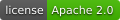
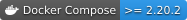
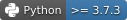
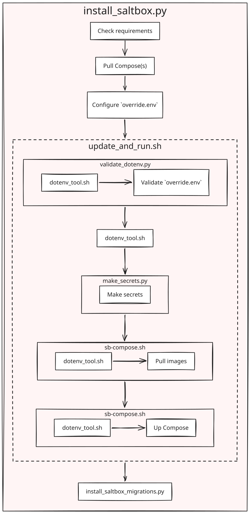

<div align = right>

&ensp;[<kbd> <br> EN <br> </kbd>](./README.md)&ensp;
&ensp;[<kbd> <br> RU <br> </kbd>](./README_RU.md)&ensp;

</div>

---

<table width="100%">
<tr><td align="center">


<hr>

<h4>Salt.Box – веб-интерфейс для управления конфигурациями <a href="https://saltproject.io/" target="_blank">SaltStack</a></h4>

<a href="https://dev.saltbox.pro/saltbox/saltbox-compose/-/badges/release.svg"></a>
<a href="./LICENSE.txt"></a>
<a href="https://img.shields.io/badge/Docker%20Engine-%3E%3D%2025.0-2496ED?logo=docker&logoColor=white"></a>
<br>
<a href="https://img.shields.io/badge/Docker%20Compose-%3E%3D%202.20.2-2496ED?logo=docker&logoColor=white"></a>
<a href="https://img.shields.io/badge/Python-%3E%3D%203.7.3-3776AB?logo=python&logoColor=white"></a>

<h3>Официальная документация Salt.Box</h3>

<a href="https://saltbox.pro/docs/intro/"></a>
<a href="https://saltbox.pro/docs/intro/"></a>

<!-- FIX: redirect on ru locale, currently both point to /docs/intro/ -->

</td></tr>
</table>

## Содержание

- **[Общие сведения](#общие-сведения)**
- **[Быстрый старт](#быстрый-старт)**
  - [Требования](#требования)
  - [Установка через `install_saltbox.py`](#установка-через-install_saltboxpy)
- **[Ручная установка](#ручная-установка)**
  - [Вспомогательные скрипты](#вспомогательные-скрипты)
  - [Стартовый скрипт `update_and_run.sh`](#стартовый-скрипт-update_and_runsh)
- **[Конфигурация](#конфигурация)**
  - [HTTPS](#https)
  - [Работа за обратным прокси](#работа-за-обратным-прокси)
- **[Эксплуатация](#эксплуатация)**
  - [Автотесты](#автотесты)
  - [Режим разработки](#режим-разработки)
  - [Очистка](#очистка)
  - [Запуск без доступа в Интернет](#запуск-без-доступа-в-интернет)
- **[Соглашения по разработке](#соглашения-по-разработке)**
  - [Python-скрипты](#python-скрипты)
  - [Docker Compose](#docker-compose)
  - [Redis: каналы](#redis-каналы)
  - [Keycloak](#keycloak)
- **[Лицензия](#лицензия)**


## Общие сведения

**Salt.Box** управляет программными конфигурациями рабочих станций в гибридной
ИТ-инфраструктуре: инвентаризация аппаратного и программного обеспечения,
управление групповыми политиками, развёртывание прикладного ПО и перевод
рабочих станций на GNU/Linux. Задачи конфигурирования выполняются асинхронно
на отдельных машинах или их группах, могут запускаться по событиям и
управляются через единый веб-интерфейс с многопользовательским доступом на
основе ролей, отчётностью и интеграционной шиной для подключения модулей,
расширяющих функциональность платформы.

Этот репозиторий, **`saltbox-compose`**, представляет собой Docker Compose
развёртывание Salt.Box – он собирает воедино SaltStack master и всё
необходимое для запуска веб-интерфейса в виде одного инстанса:

- **Keycloak** – аутентификация
- **Redis** и **RabbitMQ** – доставка задач и событий
- **MongoDB** – хранилище данных
- **OPA** – проверка политик доступа
- **Nginx** – прокси с терминированием TLS перед всем стеком

> Сама логика конфигурирования вынесена за пределы этого репозитория, в
отдельные SLS-репозитории – [**Configuration Boxes**](https://dev.saltbox.pro/configuration.boxes)

## Быстрый старт

Развертывание локального инстанса **Salt.Box** занимает несколько минут.

> **ПРИМЕЧАНИЕ:** 
> Примеры в этом разделе рассчитаны на shell **НЕ** root пользователя – самой
> команде `docker` нужны root-привилегии. Не используйте `sudo`, если вы уже
> работаете от root или настроили [rootless-режим
> Docker](https://docs.docker.com/engine/security/rootless/)

> **ВНИМАНИЕ!**
>
> Добавление пользователя в группу `docker` фактически равносильно
> получению **root-доступа** – это позволяет запускать привилегированные команды
> через `Docker Engine`. Если это критично, лучше использовать [rootless-режим](https://docs.docker.com/engine/security/rootless/)

### Требования

| Требование     | Версия     |
|----------------|------------|
| Docker Engine  | >= 25.0    |
| Docker Compose | >= 2.20.2  |
| Python         | >= 3.7.3   |

**Redis** требует включённого переподключения памяти (`overcommit`) – рекомендуется
задать данную настроку для хоста:

```bash
sudo sh -c "echo 'vm.overcommit_memory=1' > /etc/sysctl.d/saltbox.conf"
sudo sysctl -p /etc/sysctl.d/saltbox.conf
```

### Установка через `install_saltbox.py`

Скопируйте скрипт [`install_saltbox.py`](./bin/install_saltbox.py) в директорию,
где должны располагаться файлы репозитория [**Salt.Box Compose**](https://dev.saltbox.pro/saltbox/saltbox-compose/-/tree/dev/).
Запустите скрипт:


```bash
python3 ./install_saltbox.py
```
<details>
<summary><b>Показать превью установки</b></summary>


</details>

---

Когда `install_saltbox.py` завершит загрузку и настройку необходимых компонентов, **автоматически**
выполнится стартовый скрипт
[`update_and_run.sh`](#стартовый-скрипт-update_and_runsh), при этом инстанс **Salt.Box** будет
запущен без каких-либо дополнительных действий.

#### Использование

```
usage: install_saltbox.py [-h] [--list-addons] [--addons ADDONS]
                          [--admin ADMIN]
                          [--compose-ref {RELEASE,PRERELEASE,dev}] [--cleanup]
                          [--explicit-secret EXPLICIT_SECRET] [--git]
                          [--host HOST] [--host-is-name] [--port PORT] [-n]
                          [--no-cache] [--no-progress] [-s] [-u] [-v]
                          [OVERRIDE ...]

Run Salt.Box Docker Compose based instance from scratch

positional arguments:
  OVERRIDE              Extra values to include into dotenv in form of
                        NAME='VAL'

optional arguments:
  -h, --help            show this help message and exit
  --list-addons         List addons in JSON format and exit
  --addons ADDONS       Install also official Salt.Box Addons: `FileBrowser`,
                        `Inventory`, `Metric`, `Scheduler`, `ClientToolkit`,
                        `Migrations`, `FREE`, `ALL`, `NONE`. `FREE` by
                        default. SOME ADDONS ARE PROPRIETARY, TOKEN REQUIRED.
                        Can be specified multiple times.
  --admin ADMIN         The Salt.Box Administrator's login
  --compose-ref {RELEASE,PRERELEASE,dev}
                        Salt.Box Compose Git reference to obtain. `RELEASE`
                        for latest release, `PRERELEASE` for latest release OR
                        pre-release (what is the latest). `dev` for the same
                        name branch. `RELEASE` by default.
  --cleanup             Cleanup possibly existing Salt.Box instance with the
                        same COMPOSE_PROJECT_NAME. BEWARE OF DATA LOST!
  --explicit-secret EXPLICIT_SECRET
                        Set a secret value explicitly in form of `NAME=VALUE`,
                        use `saltbox_admin_password=VALUE` to set the Salt.Box
                        Administrator's password. Can be specified multiple
                        times.
  --git                 Clone Git repositories instead of downloading archives
  --host HOST           Hostname or real address to serve on, `saltbox.local`
                        by default
  --host-is-name        Force SSL cert for DNS name even if `host` looks like
                        IP address
  --port PORT           Port to serve HTTPS, `443` by default
  -n, --non-interactive
                        Do not ask to input, use defaults
  --no-cache            Remove previously downloaded archives of repositories
  --no-progress         Do not show downloading progress, CI-friendly
  -s, --skip-check      Do not check Docker install before run
  -u, --skip-run        Prepare but do not run
  -v, --verbose         Print more info

Set `SALTBOX_INSTALL_TOKEN` environment variable to use access token for
proprietary modules
```

#### Как это работает

Упрощённая иерархия вызовов скрипта [`install_saltbox.py`](./bin/install_saltbox.py):


<p style="text-align: center; margin-bottom: 0;">
  
</p>


## Ручная установка

Используйте этот вариант установки, если не хотите, чтобы [`install_saltbox.py`](./bin/install_saltbox.py) сам
занимался загрузкой и настройкой.

### Вспомогательные скрипты

Полезные скрипты собраны в каталоге [`./bin/`](./bin/). Их следует запускать
из корня репозитория по относительному пути, например `./bin/sb-compose.sh`.

| Скрипт                            | Назначение                                                            |
|-----------------------------------|---------------------------------------------------------------------|
| `sb-compose.sh`                   | **Рекомендуемый способ** управления запущенным инстансом – тонкая обёртка над `docker compose` |
| `update_and_run.sh`               | Основной стартовый скрипт                                            |
| `sb-exec.sh`                      | Быстрые команды для типовых операций                                 |
| `dotenv_tool.sh`                  | Чтение значений из `env-файлов`, например `./bin/dotenv_tool.sh list`  |
| `validate_dotenv.py`              | Проверка `override.env` на основные ошибки                           |
| `make_secrets.py`                 | Создание требуемых системных паролей                                 |
| `get_ca.sh`                       | Получение локального CA-сертификата `ca.crt` (опционально – импорт в Firefox) |
| `install_saltbox.sh`              | Загрузка [**Salt.Box Compose**](https://dev.saltbox.pro/saltbox/saltbox-compose/-/tree/dev/), настройка и запуск                        |
| `install_saltbox_migrations.sh`   | Загрузка **Salt.Box Migration Compose**, настройка и запуск             |
| `sb-images-export.sh`             | Выгрузка текущих образов на диск, например для offline-хоста         |
| `sb-images-import.sh`             | Загрузка образов, выгруженных из `sb-images-export.sh`                  |
| `image_tags.py`                   | Проверка актуальных тегов релизов используемых образов               |
| `git_pull_dev_repos.py`           | _Только для разработки_ – обновление исходных Git-репозиториев       |

`sb-compose.sh` также передаёт в Docker Compose дополнительные `dotenv-файлы`.

#### Приоритет `dotenv` файлов
```
base.env → _UPDATE_AND_RUN_EXTRA_ENV_FILES → override.env
```
Некоторые скрипты зависят друг от друга. Они должны быть **исполняемыми**, если
система сбросила флаг, верните его:

```bash
chmod a+x ./bin/*
```

### Стартовый скрипт `update_and_run.sh`

Простой способ запустить систему – выполнить данный скрипт:

```bash
sudo ./bin/update_and_run.sh
```

Скрипт:
- Создаёт секреты через `./bin/make_secrets.py`
- Обновляет Docker образы
- Выводит учётные данные администратора по умолчанию
- Запускает инстанс **Salt.Box** через `./bin/sb-compose.sh`

Используйте `override.env`, чтобы переопределить значения по умолчанию из
`base.env`.

> **ПРИМЕЧАНИЕ:**
> `override.env` имеет *НАИВЫСШИЙ* приоритет и переопределяет все остальные
значения. При этом уже выполненные ранее подстановки значений НЕЛЬЗЯ изменить через
`override.env`. Например, `SOME_PATH="${LOCAL_PATH}/file.yaml"` не изменится,
если переопределить `LOCAL_PATH` позже

- Используйте флаг `-h` или `--help`, чтобы посмотреть опции скрипта

- Чтобы сделать UI доступным по имени хоста или адресу, отличному от
`localhost`, переопределите переменные, у которых `localhost` задан по
умолчанию

> **ВНИМАНИЕ!**
>
> Убедитесь, что нет предупреждений о незаданных переменных


## Конфигурация

### HTTPS

Система требует, чтобы HTTP-соединения были терминированы по **SSL**. При первом
запуске система создаёт приватный удостоверяющий центр (CA) и сертификат для
веб-сервера.

Сертификат удостоверяющего центра можно получить командой:

```bash
sudo ./bin/get_ca.sh
```

> **ATTENTION!**
> 
> Система должна быть запущена

Сертификат будет сохранён в файл `ca.crt` в текущем каталоге и может быть установлен в браузер, чтобы тот доверял сайту веб-интерфейса.

Сгенерированный сертификат по умолчанию привязан к DNS-именам `localhost` и
`saltbox.local`. Чтобы это изменить, переопределите переменную
`WEB_SERVER_SSL_ALT_NAMES_DNS` и/или `WEB_SERVER_SSL_ALT_NAMES_IP` – для
доступа к системе по IP-адресу, а не по DNS-имени. Обе переменные могут
задаваться в виде списка через запятую.

- DNS-имена могут быть [RFC-совместимыми wildcard-именами](https://www.rfc-editor.org/rfc/rfc6125#section-7.2)
(`*.saltbox.local`, но не `*saltbox.local`).

- Wildcard-имена для IP-адресов НЕ поддерживаются

> **NOTE**: Перезапустите систему, чтобы применить изменения и пересоздать
сертификат
---
Сертификат *из коробки* также можно заменить на собственный:

```bash
sudo ./bin/sb-compose.sh cp CUSTOM_CERT proxy:/etc/nginx/ssl/proxy.crt
sudo ./bin/sb-compose.sh cp CUSTOM_CERT_KEY proxy:/etc/nginx/ssl/proxy.key
```

> **ВНИМАНИЕ!**
>
> Система должна была быть запущена хотя бы один раз ранее
>
> Изменение переменных `WEB_SERVER_SSL_ALT_NAMES_*` приведёт к перезаписи
собственного сертификата заново сгенерированным

### Работа за обратным прокси

Прежде всего убедитесь, что `WEB_SERVER_OUTER_SOCKET` совпадает с
`server_name` и портом обратного прокси.

**Nginx** может быть установлен как на том же хосте, что и **Salt.Box**, так и на
отдельном. Во втором случае убедитесь, что **Salt.Box** доступен для хоста
**Nginx**, например, командой:

```bash
curl http://<SALTBOX_HOST>:<SALTBOX_WEB_SERVER_PORT>/auth/keycloak/realms/salt.box/.well-known/openid-configuration
```

**В ответ должен прийти длинный JSON**.

Ниже приведён пример конфигурации Nginx.

```nginx
server {
  server_name <NAME>;
  client_max_body_size 256m;

  access_log /var/log/nginx/saltbox_access.log;
  error_log /var/log/nginx/saltbox_error.log;

  location / {
    add_header X-Frame-Options 'SAMEORIGIN';
    proxy_set_header Host $host;
    proxy_set_header X-Real-IP $remote_addr;
    proxy_set_header X-Forwarded-For $proxy_add_x_forwarded_for;
    proxy_set_header X-Forwarded-Proto $scheme;
    proxy_set_header X-Forwarded-Host $host;
    proxy_set_header Upgrade $http_upgrade;
    proxy_set_header Connection 'upgrade';

    proxy_pass https://<SALTBOX_HOST>:<SALTBOX_WEB_SERVER_PORT>;
  }

  listen 443 ssl http2;
  ssl_certificate <PATH_TO_CERT>;
  ssl_certificate_key <PATH_TO_CERT_KEY>;
  < OTHER SSL SETTTINGS DEPENDS ON CERT>
}

server {
  server_name <NAME>;
  listen 80;
  return 301 https://$host$request_uri;
}
```

> **ПРИМЕЧАНИЕ**
> 1. Не забудьте задать переменные `WEB_SERVER_SSL_ALT_NAMES_*` в соответствии
с URL из `proxy_pass`
>
> 2. Не забудьте заменить плейсхолдеры `< ... >` и проверить конфигурацию командой `sudo nginx -t`


## Эксплуатация

### Автотесты

Чтобы запустить набор тестов, включите `compose-autotests.yaml` в локальном
`override.env`. Затем выполните:

```bash
sudo ./bin/sb-compose.sh up autotests
```

Автотестам нужен прямой доступ к **API Keycloak**, поэтому существующий `realm`
следует пересоздать. Как альтернатива – можно включить чекбокс `Direct access
grants` в настройках клиента Keycloak.


Чтобы не тянуть новый образ:

```bash
sudo ./bin/sb-compose.sh up autotests --pull=never
```

### Режим разработки

#### Обзор

Режим разработки позволяет собирать образы самостоятельно вместо загрузки
готовых и добавляет ряд полезных `env` переопределений.

Посмотрите раздел [**Dev options**](https://dev.saltbox.pro/saltbox/saltbox-compose/-/blob/dev/base.env?ref_type=heads#L251-298) в своей копии файла [`base.env`](base.env).
Чтобы включить dev-опции, раскомментируйте нужные строки `COMPOSE_FILE=`.
Затем запустите `compose` как обычно.

> **NOTE:** Используйте флаг `--watch` или переключайте [**watch**](https://docs.docker.com/compose/how-tos/file-watch/) режим клавишей `w` в **attached** режиме, чтобы пересобирать dev-сервисы при изменениях

> **ВНИМАНИЕ!**
>
> Не используйте режим разработки в проде – он может изменить
данные

#### Сборка образов в режиме разработки

Чтобы собрать чистые образы, используйте команду с включёнными
переопределениями env-переменной `COMPOSE_FILE`:

```bash
sudo ./bin/sb-compose.sh build --no-cache
```

- `--no-cache` гарантирует сборку с актуальными зависимостями

#### Подключение к инстансу Redis (redis-salt)

В режиме разработки можно подключиться к Redis по URL
`rediss://localhost:6379`. Поскольку включён TLS, клиент
может либо пропустить проверку сертификата (опция `--insecure`), либо
использовать CA-сертификат, который можно получить командой:

```bash
sudo ./bin/get_ca.sh
```

> **ВНИМАНИЕ!**
>
> Система должна быть запущена

#### Тестовые минионы

Режим разработки поднимает несколько фейковых минионов в режиме
`replica`. Необходимая настройка находится в файле [`base.env`](https://dev.saltbox.pro/saltbox/saltbox-compose/-/blob/dev/base.env?ref_type=heads#L286).

> **ВНИМАНИЕ**
>
> Минионы НЕ сохраняют свои ключи на мастере между перезапусками

Некоторые операции могут привести к потере минионов.
Если это произошло, используйте следующую команду – она переподключит минионов:

```bash
sudo ./bin/sb-compose.sh restart salt-master
```

> **ПРИМЕЧАНИЕ:**
> `./bin/sb-compose.sh up --force-recreate salt-master` не пересоздаёт
минионов заново

#### Обновление dev Git-репозиториев

Вспомогательный скрипт `git_pull_dev_repos.py` подтягивает изменения для Git-репозиториев,
подключённых как `build context` или `volume` в dev-переопределениях:

```bash
./bin/git_pull_dev_repos.py
```

Он вызывается из `./bin/update_and_run.sh` каждый раз, если текущий каталог
является Git-репозиторием и `HEAD` указывает на ветку.

### Очистка

#### Полная очистка данных

После изменений созданные контейнеры и *volume-ы* могут стать несовместимы с
текущим кодом без опеределнныйх миграций.

Чтобы устранить проблемы запуска в среде разработки, остановите контейнеры
через `^C` и удалите их:

```bash
sudo ./bin/sb-compose.sh -f compose.yaml -f compose-dev-override.yaml down --volumes
```

> **ВНИМАНИЕ!**
> Флаг `--volumes` **УДАЛИТ** подключённые *volume-ы*, что приведёт к потере
данных. Убедитесь, что не теряете нужные данные

#### Очистка только данных Keycloak

Выполните следующие команды:

```bash
sudo ./bin/sb-compose.sh down
sudo ./bin/sb-compose.sh down keycloak-db --volume
```

При следующем запуске realm будет пересоздан.

#### Очистка неиспользуемых объектов Docker

По мере изменения кода и конфигураций создаются новые слои и другие объекты.
Чтобы освободить ресурсы, периодически выполняйте команду:

```bash
sudo docker system prune --force
```

- Обычно это безопасно и удаляет только неиспользуемые данные.

### Запуск без доступа в Интернет

**Salt.Box Compose** требует доступ в Интернет для получения образов. Также
Salt.Box использует Интернет для загрузки [**Configuration Boxes**](https://dev.saltbox.pro/configuration.boxes).

Допустим, есть целевой *offline-хост* для установки **Salt.Box**, и на нём уже
установлены [требования Salt.Box Compose](#требования), <u>то порядок переноса
образов на него такой</u>:

1. На хосте с доступом в Интернет один раз настройте и запустите **Salt.Box** по
   стандартной инструкции. Конфигурация Compose в `override.env` ДОЛЖНА
   совпадать с целевым offline-хостом как минимум в части подключённых
   Compose-файлов

   > **ПРИМЕЧАНИЕ:**
   > Включённые [dev-переопределения Compose](#режим-разработки) с секциями
   > `service[].build` могут потребовать переноса дополнительных базовых
   > образов вручную

2. Выгрузите образы командой `sudo ./bin/sb-images-export.sh`. Инстанс
   **Salt.Box** можно остановить, но не удалять. Образы по умолчанию сохранятся
   в каталог `./images/`

3. Разместите локальные git-репозитории нужных SLS-репозиториев, они же
   [**Configuration Boxes**](https://dev.saltbox.pro/configuration.boxes), в каталоге `LOCAL_CONFIG_BOXES_PATH` (по умолчанию —
   `./_local-config-boxes/` внутри каталога Compose)

4. Добавьте новые репозитории на странице «Configuration Repositories» с
   URL вида `file:///mnt/config-boxes/REPO_NAME`, где `REPO_NAME`
   соответствует имени локального репозитория.

5. На странице «Шаблоны конфигураций» offline-инстанса включите
   каждый добавленный репозиторий и нажмите кнопку «Подключить» в действиях рядом
   с переключателем. Затем кнопку «Синхронизировать». Убедитесь, что новые файлы получены, для этого используйте команду `sudo
   ./bin/sb-exec.sh salt-run fileserver.file_list`
   
   - Локальный Salt Master должен быть включён

6. Скопируйте каталог `saltbox-compose`, включая каталог `images/`, на
   целевой offline-хост. Смените текущий рабочий каталог на новый
   `saltbox-compose`. Если какие-то модули подключены через переменные
   `_UPDATE_AND_RUN_EXTRA_*`, то __соответствующие каталоги тоже нужно
   скопировать__

7. Загрузите образы командой `sudo ./bin/sb-images-import.sh`

8. Запустите [стартовый скрипт](#стартовый-скрипт-update_and_runsh): `sudo
   ./bin/update_and_run.sh --no-pull`
   - Флаг `--no-pull` заставляет Compose использовать локальные образы

9. Снова добавьте локальные репозитории на странице «Шаблоны конфигураций» 

Позже, когда изменятся секции `sshfs_files` в манифесте SLS-репозиториев,
AUX-файлы можно синхронизировать на онлайн-инстансе и скопировать на
offline. AUX-файлы следует копировать вместе с файлами контрольных сумм из
каталога `SSHFS_STORAGE_PATH` (по умолчанию – `./_sshfs-storage/` внутри
каталога Compose).


## Соглашения по разработке

### Python-скрипты

Python-скрипты в подкаталоге `./bin/` должны быть совместимы и не иметь
внешних зависимостей, кроме стандартной библиотеки Python.

Для сопровождения скриптов рекомендуется запускать подходящее окружение с
LSP:

```bash
uv sync --python 3.14
source .venv/bin/activate
```

При этом сами скрипты *ОБЯЗАТЕЛЬНО* нужно тестировать на минимально
совместимой версии Python (`v3.7.3`). Например:

```bash
pyenv install
pyenv exec python3 ./bin/install_saltbox.py
```

 - Утилита [pyenv](https://github.com/pyenv/pyenv) берёт версию из файла
[`./.python-version`](./.python-version). Установка требуется только один раз

### Docker Compose

- Ключевые слова `healthcheck.{interval,timeout,start_period,start_interval}`
появились в Docker Compose `2.20.2` – это __текущее ограничение минимальной
версии__
- Спецификация `develop` появилась в Docker Compose `2.22.0`, её следует
избегать в основном файле [`compose.yaml`](compose.yaml)
- Избегайте нотации значений по умолчанию `'{VAR:-value}'` для переменных,
поскольку значения по умолчанию в [`base.env`](./base.env) более наглядны

### Redis: каналы

Имя *hash-а* должно иметь вид `OBJ_TYPE:{ID}:DATA_TYPE`, например
`minion:{MID}:grains`. Также используйте единственное число для типа
объекта и множественное – для типа данных, поскольку у объекта может быть
множество значений.

### Keycloak

Административный интерфейс Keycloak: http://localhost/auth/keycloak/.
Пользователь `admin`, пароль находится в файле `./secrets/keycloak_admin_password`.


## Лицензия

Salt.Box Compose распространяется под лицензией **Apache License 2.0** – полный
текст см. в [`LICENSE.txt`](./LICENSE.txt).
