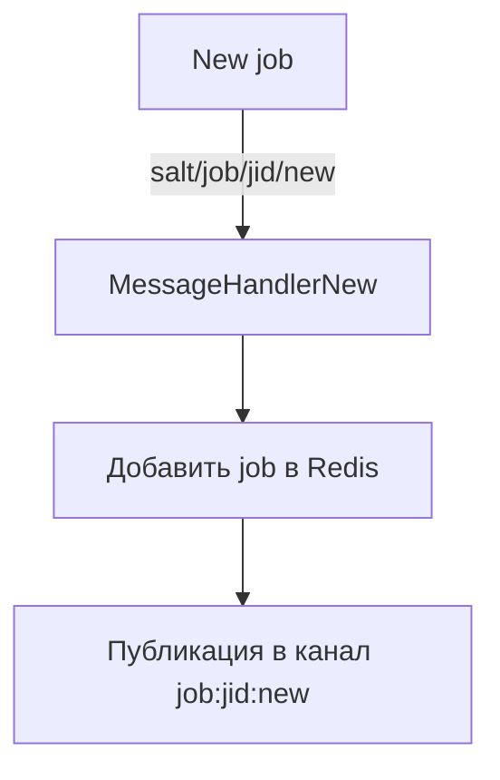
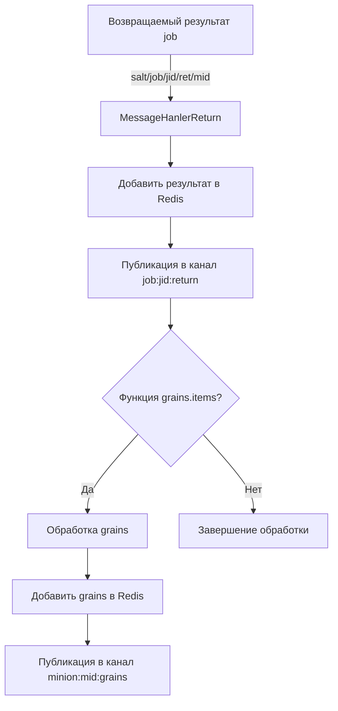

# Redis Bridge for SaltStack

Этот модуль предназначен для интеграции SaltStack с Redis, позволяя публиковать события Salt в Redis для дальнейшей обработки или мониторинга.

## Установка

1. Скопируйте файл `redis_bridge.py` в директорию `/srv/salt_extmod/engines/` на вашем Salt Master сервере.

2. Добавьте следующую конфигурацию в файл конфигурации Salt Master (`/etc/salt/master`):

    ```yaml
    module_dirs:
      - /srv/salt_extmod/  # Директория для пользовательских модулей

    engines:
      - redis_bridge:  # Аргументы для функции start()
          host: localhost  # Хост Redis
          port: 6379  # Порт Redis
          db: 0  # Номер базы данных Redis
          expire: 3600  # Время истечения данных в секундах (необязательно)
    ```

3. Перезапустите Salt Master:

    ```sh
    sudo systemctl restart salt-master
    ```

## Использование

После установки и настройки модуля, Salt Master будет публиковать события в Redis. Логи и исключения будут записываться в лог Salt Master.

## Описание кода

### Основные компоненты

- **Функция `__virtual__`**:
  Проверяет, что роль текущего узла — мастер, и возвращает `True`, если это так.

- **Функция `jid_to_epoch`**:
  Преобразует идентификатор job (JID) в метку времени (epoch).

- **Исключение `StopProcessing`**:
  Исключение, которое сигнализирует о том, что сообщение не требует дальнейшей обработки.

- **Класс `MessageHanlerBase`**:
  Абстрактный базовый класс для обработчиков сообщений. Содержит метод `handle`, который проверяет, соответствует ли тег шаблону `TAG_PATTERN`, и метод `process`, который должен быть реализован в подклассах.

- **Класс `MessageHandlerNew`**:
  Обработчик для новых job. Если тег соответствует шаблону `salt/job/{jid}/new`, он добавляет job в Redis и публикует сообщение в канал Redis.

- **Класс `MessageHanlerReturn`**:
  Обработчик для возвращаемых результатов job. Если тег соответствует шаблону `salt/job/{jid}/ret/{mid}`, он обрабатывает возвращаемые данные и публикует их в Redis.

- **Класс `RedisPusher`**:
  Класс для отправки данных в Redis. Инициализируется с параметрами подключения к Redis и временем истечения данных.

- **Асинхронная функция `_async_start`**:
  Запускает обработчик событий Salt и передает их в `RedisPusher`.

- **Функция `start`**:
  Запускает асинхронную функцию `_async_start` с параметрами подключения к Redis.

## Пример конфигурации

```yaml
module_dirs:
  - /srv/salt_extmod/
auto_accept: true
engines:
  - redis_bridge:  # Аргументы для функции start()
      host: fastms-redis-salt  # Хост Redis
      # port: 6379  # Порт Redis
      # db: 0  # Номер базы данных Redis
      expire: 604800  # Time to live for job returns and grains (sec)
schedule:
  redis_bridge_cleanup:
    hours: 3
    function: redis_bridge.cleanup_expired_jobs
    kwargs:
      expire: 604800  # Age of jobs to delete (sec)
      host: fastms-redis-salt
```

## Формат хранения данных и каналы в Redis

### Формат хранения данных

#### Новые job

Новые job будут храниться в `SortedSet` (отсортированном множестве) `jobs`. Ключом будет JSON-представление данных job, а значением — метка времени (epoch), полученная из идентификатора job (JID).

Пример:

```json
{
  "name": "jobs",
  "data": {
    "{\"jid\": \"20240903102608837473\", \"tgt_type\": \"glob\", \"tgt\": \"*\", \"user\": \"salt_api_user\", \"fun\": \"grains.items\", \"arg\": [], \"minions\": [\"06c97bc95d6f\", \"6055de24e997\", \"69464b62bc2d\", \"71c5e16be567\"], \"missing\": [], \"_stamp\": \"2024-09-03T10:26:08.844400\"}": 1672531261.0
  }
}
```

#### Возвращаемые результаты job

Возвращаемые результаты job будут храниться в хэш-таблице `job:{jid}:return`. Ключом будет идентификатор minion (MID), а значением — JSON-представление данных результата.

Пример:

```json
{
  "name": "job:20230101010101000000:return",
  "data": {
    "8b0f1a95b50b": "{\"fun\": \"test.ping\", \"jid\": \"20230101010101000000\", \"return\": true}"
  }
}
```

#### Grains

Grains будут храниться в хэш-таблице `minion:{mid}:grains`. Ключом будет имя grain, а значением — JSON-представление значения grain.

Пример:

```json
{
  "name": "minion:minion1:grains",
  "data": {
    "os": "\"Ubuntu\"",
    "cpuarch": "\"x86_64\"",
    ...
  }
}
```

### Каналы

#### Канал для новых job

Для каждого нового job будет создан канал `job:{jid}:new`, в который будет отправлено JSON-представление данных job.

Пример:

```
Канал: job:20230101010101000000:new
Сообщение: {"fun": "test.ping", "jid": "20230101010101000000", "tgt": "minion1"}
```

#### Канал для возвращаемых результатов job

Для каждого возвращаемого результата job будет создан канал `job:{jid}:return`, в который будет отправлено JSON-представление данных результата.

Пример:

```
Канал: job:20230101010101000000:return
Сообщение: {"fun": "test.ping", "jid": "20230101010101000000", "return": true}
```

#### Канал для grains

Для каждого minion будет создан канал `minion:{mid}:grains`, в который будет отправлено JSON-представление данных grains.

Пример:

```
Канал: minion:minion1:grains
Сообщение: {"os": "Ubuntu", "cpuarch": "x86_64"}
```

## Блок-схемы

### Обработка новых job



### Обработка возвращаемых результатов job


